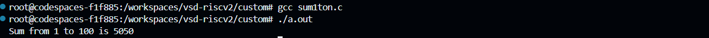
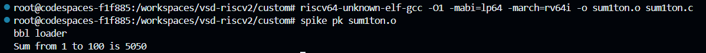
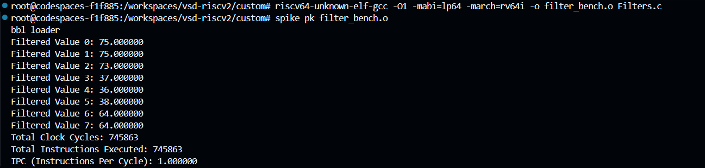
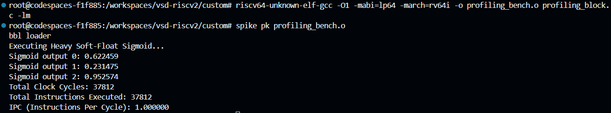

# RISC-V Core Implementation & Micro-Architectural Benchmarking
This repository documents the design, implementation, and verification of a RISC-V RV32I processor core, developed during the VSD RISC-V MYTH Workshop. 

## Day 1: Introduction to RISC-V ISA and GNU Compiler Toolchain

### From Apps to Hardware
The execution of software on physical hardware requires a highly structured translation stack. An application written in a high-level language (like C) is compiled down to an architecture-specific Assembly language (via an Instruction Set Architecture like RISC-V). This assembly is then assembled into binary machine code that the physical RTL gates can execute.
* **ISA (Instruction Set Architecture):** Acts as the abstract interface between the software compiler and the hardware processor.

### C to RISC-V Assembly Compilation
To validate the GNU toolchain and Spike Instruction Set Simulator (ISS), a standard C program was compiled natively and then cross-compiled for the RV64I architecture.

**C Compilation:**
```bash
gcc sum1ton.c
./a.out
```



**RISCV Compilation:**
```bash
riscv64-unknown-elf-gcc -O1 -mabi=lp64 -march=rv64i -o sum1ton.o sum1ton.c
spike pk sum1ton.o
```



### Custom Work
To profile the execution efficiency of the base RISC-V ISA, I developed custom C workloads to test both the strengths and weaknesses of an integer-only processor. Hardware performance counters (rdcycle and rdinstret) were utilized via inline assembly to extract exact cycle and instruction counts.

1. Strength Profile: Integer Moving Average Filter
I compiled a 1D moving average filter. The RV32I core handled the array indexing and integer ALU operations with minimal instruction overhead.



2. Weakness Profile: Soft-Float Overhead (Sigmoid Function)
To test the boundaries of the base architecture, I compiled a floating-point Sigmoid activation function. The GNU compiler was forced to inject soft-float emulation libraries.

Result: This drastically increased the binary footprint and instruction count.


