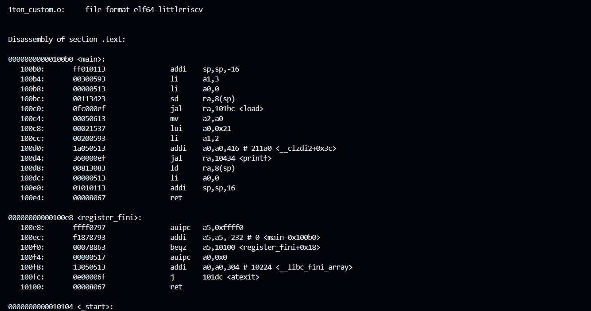
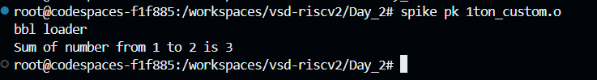
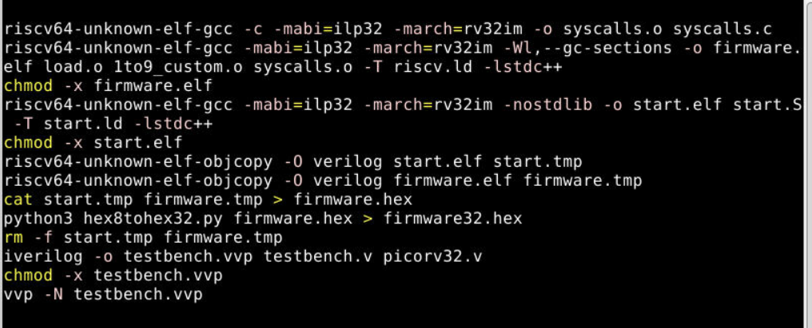
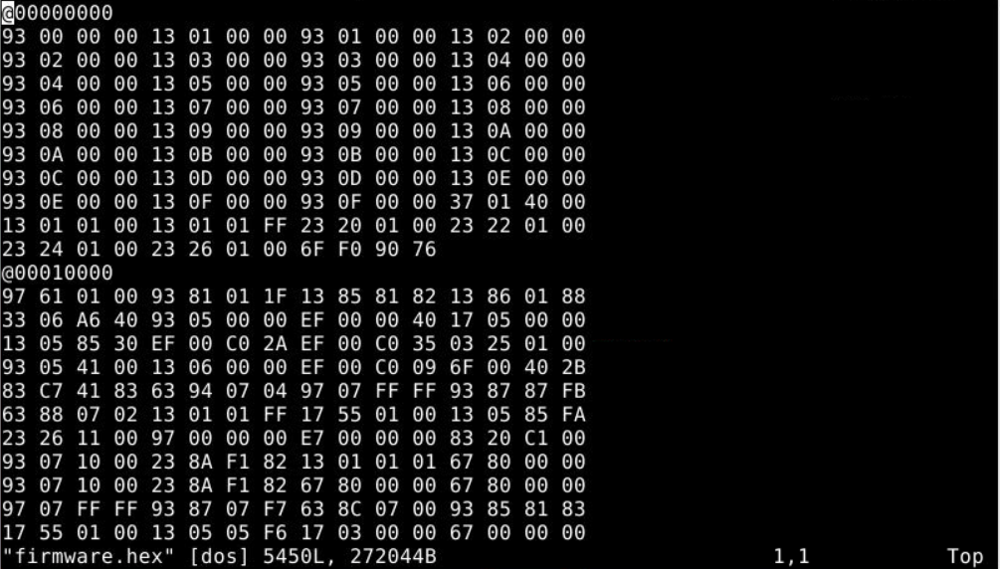

# Day 2: Application Binary Interface (ABI) and Basic Verification Flow

## 📌 Overview
Day 2 bridges the gap between software and hardware by introducing the Application Binary Interface (ABI). The lab demonstrates how C programs communicate with underlying hardware registers. The day culminates in executing a full RTL verification flow, where a C program is converted into a hex file, loaded into the memory of a Verilog-based RISC-V CPU core (`picorv32`), and executed.

## 🎯 Key Objectives
* Understand the RISC-V RV64I Base Integer Instruction Set and register allocation.
* Learn how the Application Binary Interface (ABI) facilitates function calls between C and Assembly.
* Execute a C program on a RISC-V CPU core using a Verilog testbench.
* Understand the script-based automation of converting source code to bitstreams (`.hex`) and loading them into memory.

## 🛠️ Lab 1: C to Custom Assembly via ABI
In this lab, a C program calculates the sum of numbers from 1 to 9, but the core execution is offloaded to a custom assembly file called through the ABI.

**1. Compilation with GCC Cross-Compiler:**
`custom1_to_9.c` and `load.S` are compiled together. The `-Ofast` flag is used for maximum optimization.
`bash
riscv64-unknown-elf-gcc -Ofast -mabi=lp64 -march=rv64i -o custom1_to9.o custom1_to_9.c load.S
`

**2. Verifying Assembly Instructions using Objdump:**
To inspect the generated assembly and verify that the `load.S` instructions were successfully mapped to the correct memory addresses and registers:
`bash
riscv64-unknown-elf-objdump -d custom1_to9.o | less
`

**3. Execution via Spike:**
`bash
spike pk custom1_to9.o
`

### 📸 Lab 1 Snapshots
*(Insert screenshot of your objdump output showing your assembly routine here)*

*(Insert screenshot of Spike execution showing the calculated sum here)*

## 🏗️ Lab 2: Running C Program on RISC-V CPU Core
This lab demonstrates the flow of running a C program on a pre-written RISC-V CPU core (`picorv32`) using a Verilog testbench. The code is converted to a hex format, loaded into memory, and processed by the CPU.

**1. Clone the Repository and Navigate to Labs:**
`bash
git clone https://github.com/kunalg123/riscv_workshop_collaterals.git
cd riscv_workshop_collaterals/labs
`

**2. Review the Hardware and Testbench Code:**
* **CPU Core:** View the complete Verilog netlist for the RISC-V core.
    `bash
    vim picorv32.v
    `
* **Testbench:** View the testbench file. This file contains the crucial `$readmemh("firmware.hex",memory)` command, which loads the compiled hex file into the simulated memory.
    `bash
    vim testbench.v
    `

**3. Execute the Automated Verification Script:**
The repository includes a script (`rv32im.sh`) that automates compiling the C/Assembly code into a hex file, loading it, and running the simulation. First, we grant it execution permissions, then run it:
`bash
chmod 777 rv32im.sh
./rv32im.sh
`

**4. Inspect the Hex File (Bitstream):**
After running the script, we can view the generated hex file to see exactly how the application software was converted into bitstreams for the CPU to process:
`bash
vim firmware.hex
`

### 📸 Lab 2 Snapshots
*(Insert screenshot of your terminal showing the successful output of the `./rv32im.sh` script here)*

*(Insert screenshot showing the inside of the firmware.hex file via vim here)*

## 🧠 Key Learnings
* **ABI Utilization:** Discovered how arguments are passed via standard registers (e.g., `a0`, `a1`) according to the RISC-V ABI.
* **Hex File Generation:** Understood the automated flow (`rv32im.sh`) of taking high-level C code, compiling it down to machine-readable hex bitstreams, and injecting it into an RTL testbench using `$readmemh`.
