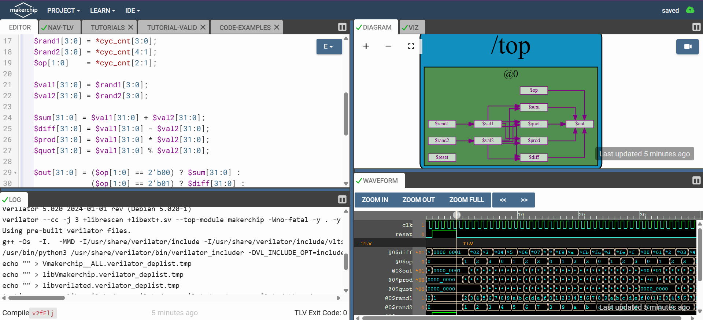
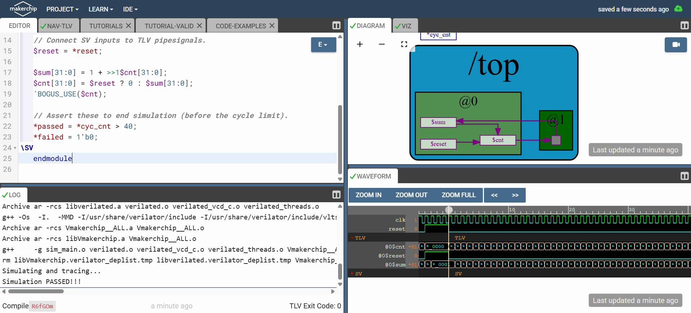
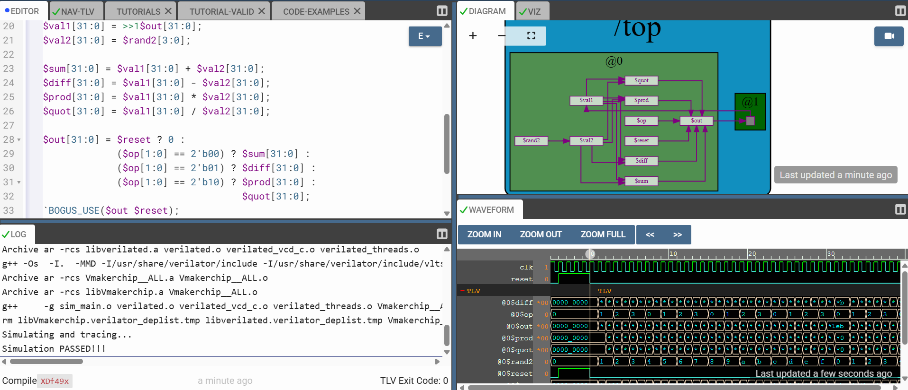
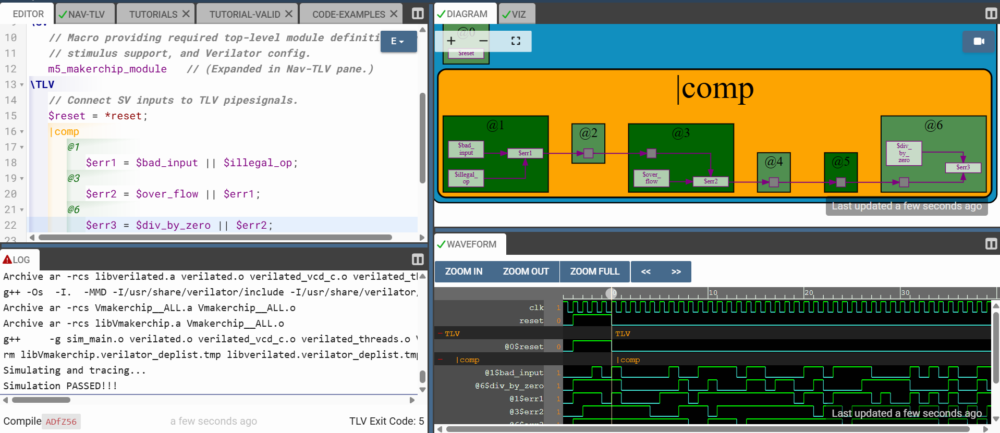
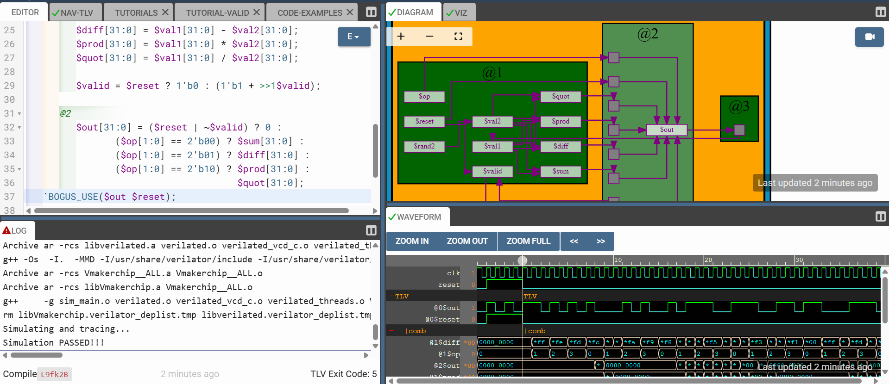
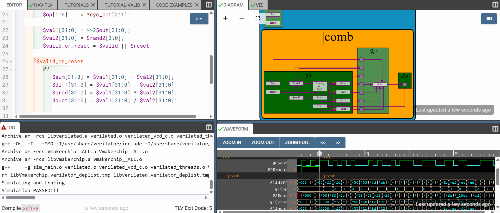
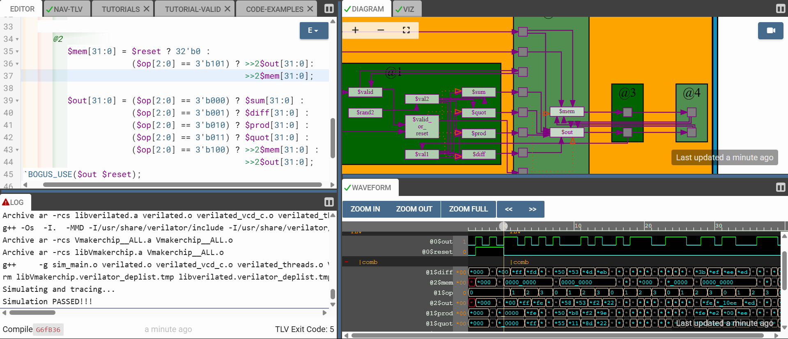

# Day 3: Digital Logic Design with TL-Verilog and Makerchip

This directory contains the implementations of foundational digital logic circuits designed using TL-Verilog in the Makerchip IDE. The labs progressively build from basic stateless logic to advanced pipelined and state-dependent architectures.

---

## 1. Combinational Logic
The starting point of the labs, focusing on basic logic gates and routing without memory or clock dependencies. 

* **Combinational Calculator:** A basic arithmetic logic unit capable of performing operations based on an opcode.

---

## 2. Sequential Logic
Introducing clock cycles and state retention using TL-Verilog's `>>1` (look-back) operator to create feedback loops.

* **Free-Running Counter:** A foundational sequential circuit that increments its value every clock cycle.

* **Sequential Calculator:** Upgrading the combinational calculator to remember previous results and use them in the next clock cycle.

---

## 3. Pipelining
Breaking down complex logic into smaller, sequential stages (using `@1`, `@2`, etc.) to increase the overall clock frequency and throughput of the design.

* **Pipelining Logic:** Demonstrating how data flows across physical pipeline stage boundaries.

* **Cycle Calculator:** Spreading the calculator's operations across multiple pipeline stages to resolve timing constraints.

---

## 4. Advanced Concepts: Validity and Memory
Optimizing the pipeline by introducing execution control and local storage.

* **Cycle Calculator with Validity:** Using the `$valid` signal to conditionally execute logic, preventing the pipeline from processing garbage data and effectively silencing unwanted warnings.

* **Calculator with Single-Value Memory:** Implementing a recall function, allowing the calculator to store a specific value and pull it back into the pipeline at a later time.

