# Day 4: RISC-V CPU Microarchitecture (Base Datapath)

This directory details the architectural realization of a single-cycle RISC-V processor datapath using TL-Verilog. The documented modules represent the construction of the core central processing unit, systematically advancing through the fundamental stages of hardware execution: Instruction Fetch, Decode, Execute, and Register Write-Back.

---

## 1. Instruction Fetch (IF)
The Fetch stage dictates the primary control flow of the processor, responsible for sequencing memory addresses and retrieving the binary instructions that drive the datapath.

* **Program Counter (PC) Sequencing:** The foundational execution loop. 
  * *Architectural Concept:* This logic establishes the default sequential execution path by instantiating an adder that increments the Program Counter by 4 bytes (one standard 32-bit RISC-V word) on every clock cycle, ensuring byte-addressable alignment.
  
  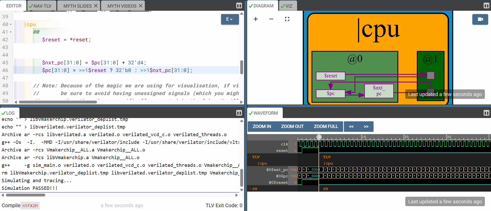

* **Instruction Memory (IMem) Interface:** The integration of the sequential PC with the localized instruction memory. 
  * *Architectural Concept:* The Program Counter acts as the physical read address pointer, instructing the IMem macro to output the specific 32-bit instruction sequence required for the current execution cycle.
  
  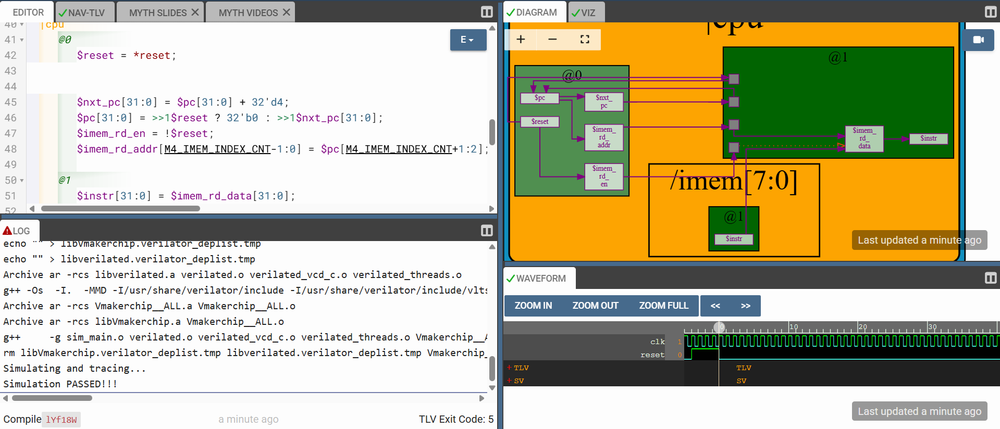

---

## 2. Instruction Decode (ID)
The Decode stage is responsible for translating the dense 32-bit binary string into explicit, actionable hardware control signals. 

* **ISA Format Categorization:** The initial tier of instruction decoding.
  * *Architectural Concept:* By analyzing specific opcode bits (bits [6:2]), the hardware routes the incoming instruction into one of the core RISC-V base formats (R, I, S, B, U, or J-type), defining how the remainder of the instruction bus should be parsed.
  
  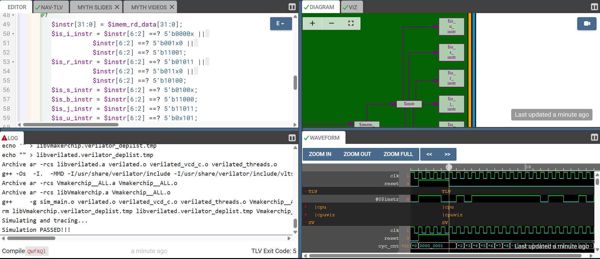

* **Dynamic Immediate Generation:** * *Architectural Concept:* Because immediate (constant) values are fragmented across different bit fields depending on the instruction format, this multiplexer logic extracts, reassembles, and correctly sign-extends those disparate bits into a uniform 32-bit operand for the ALU to process.
  
  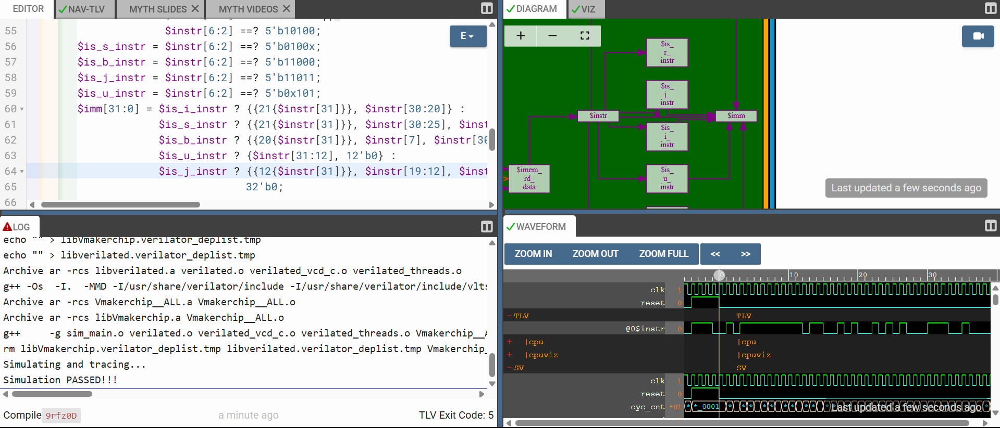

* **Control Field Extraction:** * *Architectural Concept:* Combinational slicing of the 32-bit instruction bus to isolate the `opcode` (bits [6:0]), `funct3` (bits [14:12]), and `funct7` (bits [31:25]). These fields act as the unique structural identifiers dictating the specific operation to be executed.
  
  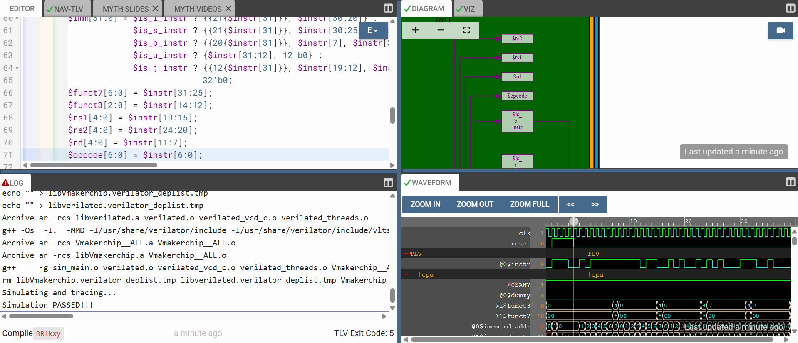

* **Operand Address Decoding:** * *Architectural Concept:* Isolating the physical hardware addresses of the required operands. This logic slices the 5-bit indices representing Source Register 1 (`rs1`), Source Register 2 (`rs2`), and the Destination Register (`rd`).
  
  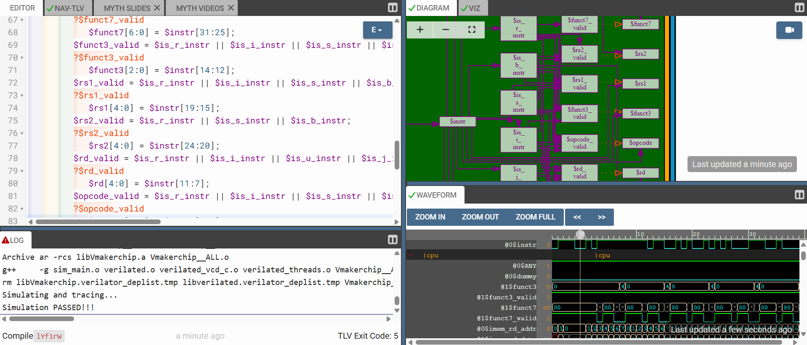

* **Explicit Instruction Decoding:** * *Architectural Concept:* Synthesizing the extracted `opcode`, `funct3`, and `funct7` fields to generate explicit, single-bit boolean control signals (e.g., `$is_add`, `$is_addi`, `$is_beq`). These signals directly drive the multiplexers in the execution stage.
  
  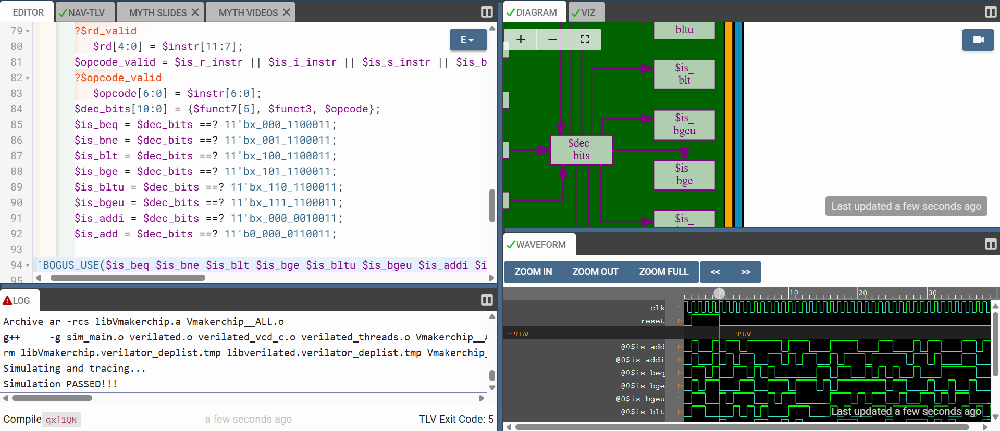

---

## 3. Register File Access
The Register File (RF) constitutes the internal, high-speed architectural state of the CPU, containing the 32 discrete registers defined by the RISC-V specification.

* **Register File Read Mapping:** * *Architectural Concept:* Hardwiring the extracted `rs1` and `rs2` index buses into the RF macro. This dynamic routing dictates which two of the 32 architectural registers will drive their stored data onto the execution buses.
  
  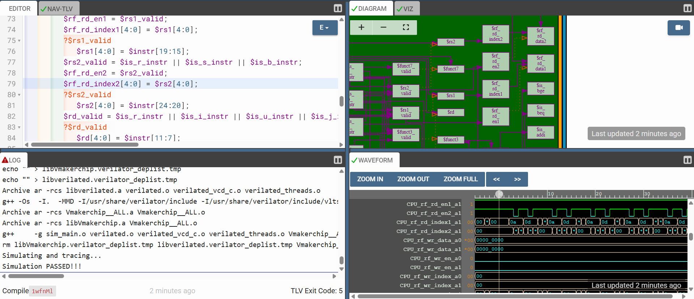

* **Conditional Read-Enable Logic:** * *Architectural Concept:* Implementing dynamic read validation. This logic ensures the RF only accesses data if the decoded instruction format explicitly requires source registers. This is a critical design practice for optimizing power consumption and preventing the propagation of invalid data.
  
  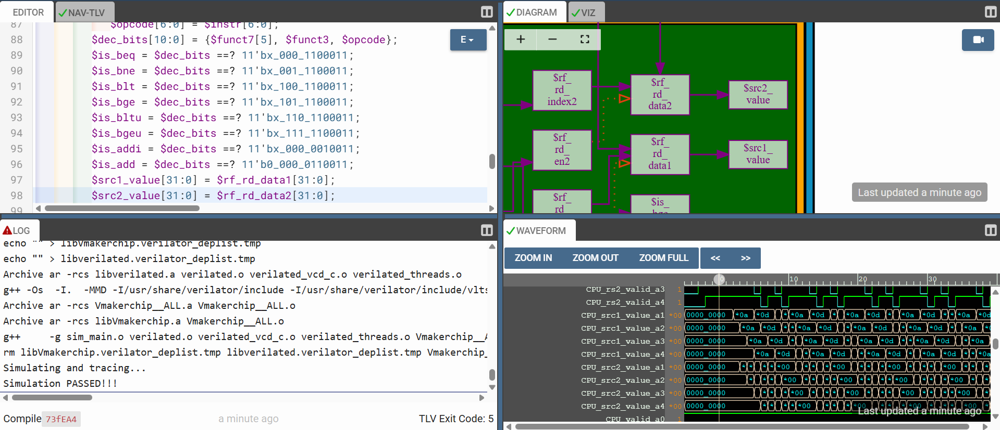

* **Write-Back with Architectural Constraints:** * *Architectural Concept:* Routing the computed ALU result back into the memory array while enforcing the strict RISC-V hardware constraint: the immutability of the zero register (`x0`). The write-enable logic intercepts and discards any operation attempting to overwrite index 0.
  
  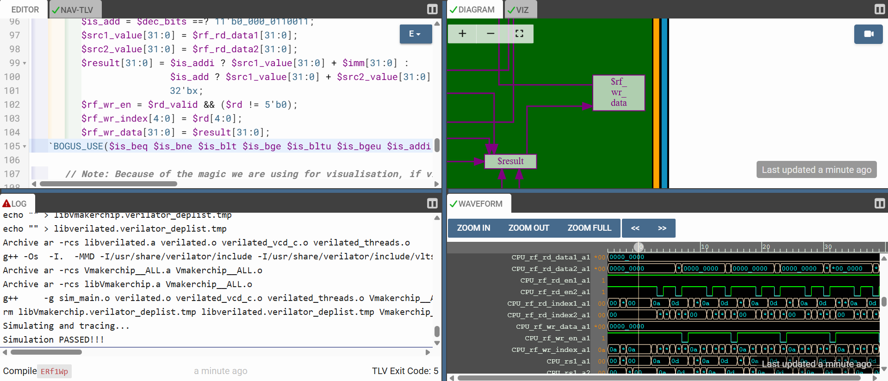

---

## 4. Execute & Datapath Control (EX)
The Execute stage contains the primary computational structures and the comparative logic necessary for altering the sequential execution path.

* **Arithmetic Logic Unit (ALU) Datapath:** * *Architectural Concept:* The central computational engine of the CPU. Driven by a large multiplexer tied to the explicit instruction decode signals, the ALU dynamically selects between various mathematical datapaths (addition, bitwise logic, shifting) to process the active source operands.
  
  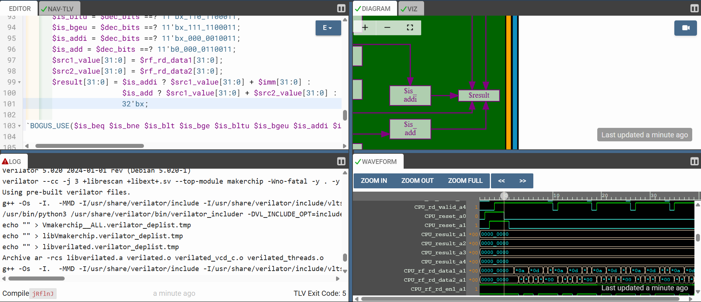

* **Conditional Branch Evaluation:** * *Architectural Concept:* The logic responsible for processing conditional control flow. Hardware comparators evaluate the two source registers based on the requested branch instruction (e.g., equality for `BEQ`, less-than for `BLT`), asserting a boolean `$taken_branch` signal if the condition resolves to true.
  
  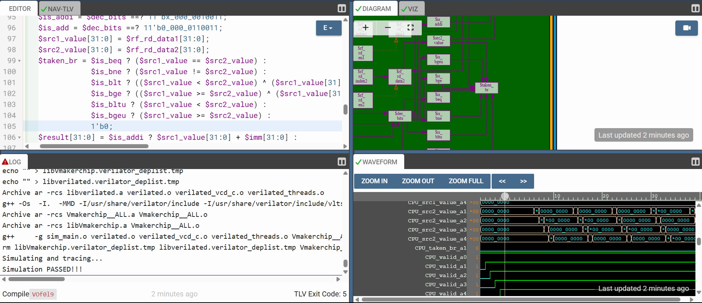

* **Control Flow Redirection:** * *Architectural Concept:* Resolving the control flow event. If a branch is evaluated as "taken", this logic updates the Program Counter multiplexer at the Fetch stage. The PC aborts the default `+4` increment and instead ingests the calculated branch target address (Current PC + Immediate), successfully redirecting the software execution path.
  
  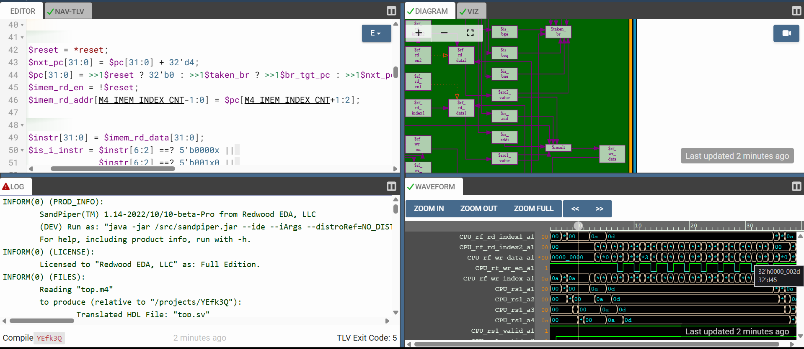
