# Day 5: Complete Pipelined RISC-V CPU Microarchitecture

This directory details the final and most complex phase of the core design: the transformation of the foundational single-cycle datapath into a high-performance, 5-stage pipelined RISC-V processor. 

While pipelining vastly increases theoretical instruction throughput by exploiting instruction-level parallelism (ILP), it introduces severe physical timing conflicts known as architectural hazards. The modules documented here encapsulate the complex control logic engineered to dynamically resolve Read-After-Write (RAW) data dependencies, control flow disruptions, and memory access latencies, all while strictly adhering to the RISC-V specification.

---

## 1. Pipeline Retiming & Execution Validity
The foundational step of pipelining requires the spatial distribution of single-cycle logic across distinct temporal clock boundaries (Fetch, Decode, Read, Execute, Write-Back).

* **3-Cycle Validity Formulation:** The `$valid` signal acts as the processor's internal traffic controller. This logic establishes the temporal boundaries of the pipeline and creates a strict filtering mechanism to ensure that "garbage" data generated during startup cannot corrupt the architectural state.
  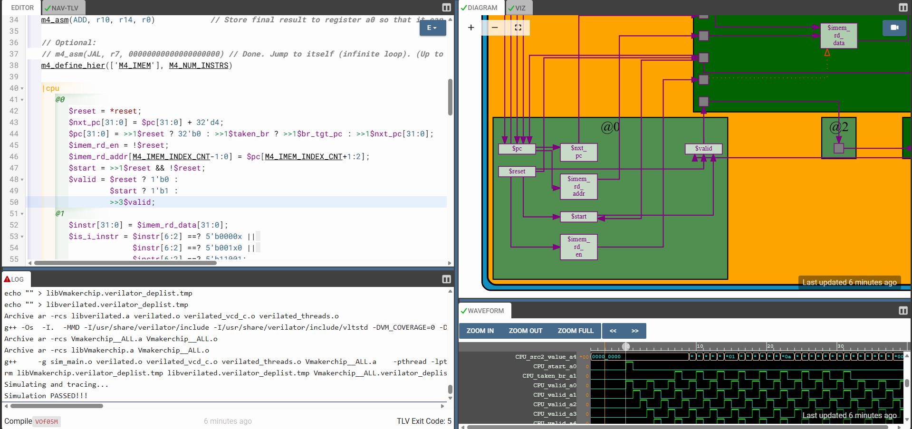

* **Pipelined RISC-V Datapath (Phase 1):** The initial structural fracturing of the CPU. This visualizes the physical separation of the fetch and decode stages from the execution hardware, relying on the compiler to automatically infer the necessary staging flip-flops between them.
  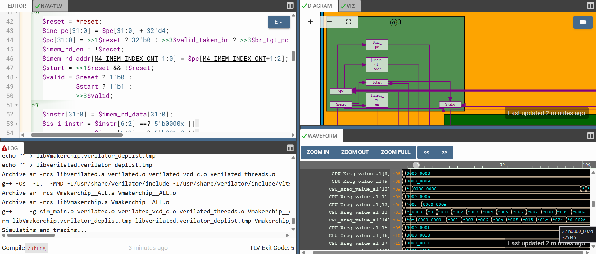

* **Pipelined RISC-V Datapath (Phase 2):** Extending the validity control deep into the execution and write-back stages. This ensures that operations with permanent consequences—like writing to the Register File—are absolutely gated by the legitimacy of the instruction currently residing in that specific pipeline stage.
  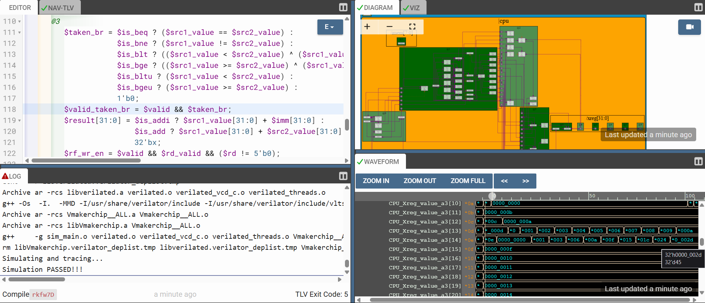

---

## 2. Resolving Data Hazards (Combinational Forwarding)
In a pipelined architecture, sequential instructions frequently depend on the results of immediately preceding operations. This creates a Read-After-Write (RAW) hazard, as the required data is still mid-flight and has not yet been committed to the Register File.

* **Register File Bypass Network:** A masterclass in temporal data routing. Rather than heavily penalizing throughput by stalling the CPU to wait for a sluggish memory write, this multiplexer logic intercepts freshly computed mathematical results mid-flight. It routes them directly from the output of a previous pipeline stage back into the input of the current execution stage, maintaining zero-cycle stalls for arithmetic dependencies.
  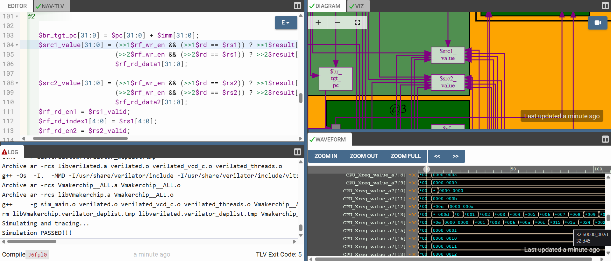

---

## 3. Resolving Control Hazards & Execution Finalization
Instructions that alter the Program Counter introduce control hazards. By the time the execution stage determines a branch is taken, the fetch stage has already loaded sequential, incorrect instructions into the early pipeline stages.

* **Dynamic Pipeline Squashing:** Handling the reality of mispredicted paths. When a branch alters the execution timeline, this logic instantly vaporizes the "phantom" instructions trapped in the shadow of the jump by forcing their validity bits to zero, effectively converting them into harmless hardware bubbles.
  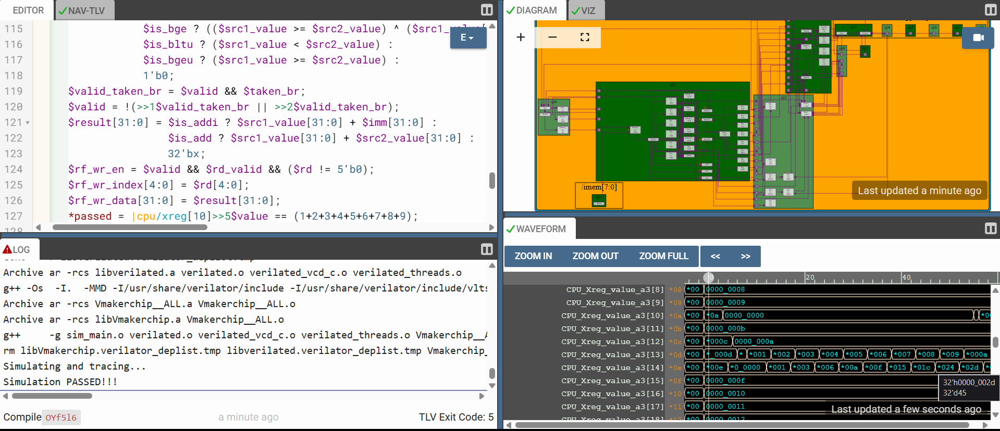

* **Complete Instruction Decode:** Finalizing the interpretation layer. This logic expands the decoding matrices to successfully identify and route the complete subset of base integer instructions required to execute a full C program compiled to RISC-V assembly.
  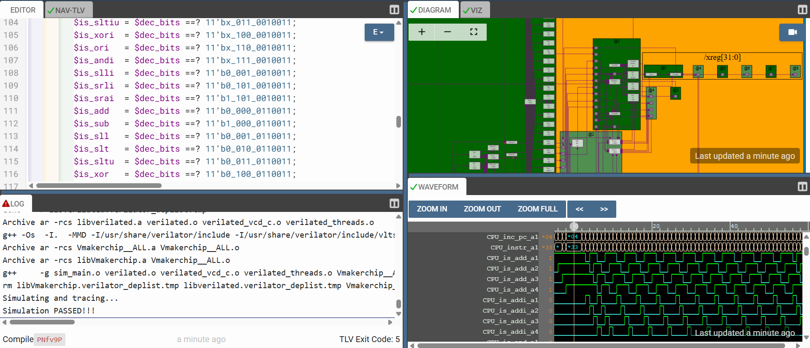

* **Complete ALU Integration:** The finalized computational engine. The ALU multiplexer is expanded to ingest the full suite of decoded control signals, enabling complex bitwise operations, logical shifts, and comprehensive arithmetic execution.
  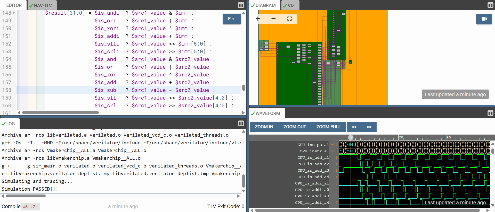

---

## 4. Memory Integration & Load-Use Hazards
Interfacing with Data Memory (DMem) introduces the most complex hardware stall condition: memory access latency. Because a read operation takes an additional cycle beyond standard computation, the standard bypass network cannot resolve the dependency in time.

* **Redirecting Loads (PC Rewind):** The ultimate timing challenge. Since memory access is inherently delayed, the pipeline executes a controlled stall. This logic detects the load-use hazard, squashes the dependent instruction, and systematically rewinds the Program Counter to re-fetch it, buying the memory block the exact amount of time it needs to resolve the read.
  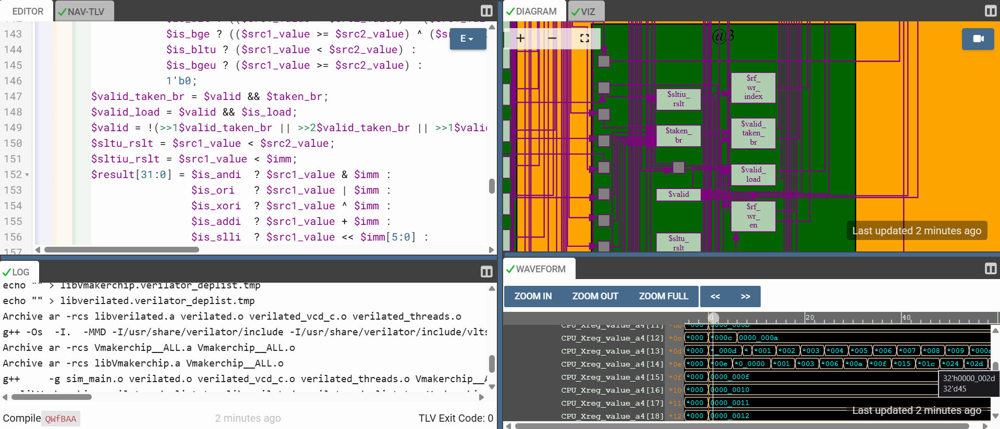

* **Load Data Multiplexing (Port Hijacking):** To ensure the delayed memory data is written back without colliding with new, incoming instructions, the hardware performs an orchestrated multiplexing of the Register File write-port. It routes the delayed `$ld_data` backward precisely during the deterministic pipeline bubble created by the stall.
  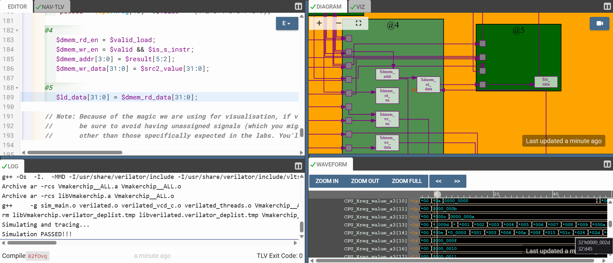

* **Load/Store Verification:** The definitive proof of concept. This waveform and log verification confirms that the memory interface operates flawlessly—successfully calculating dynamic addresses, writing to the DMem array, and retrieving data back into the architectural registers under heavy pipeline utilization.
  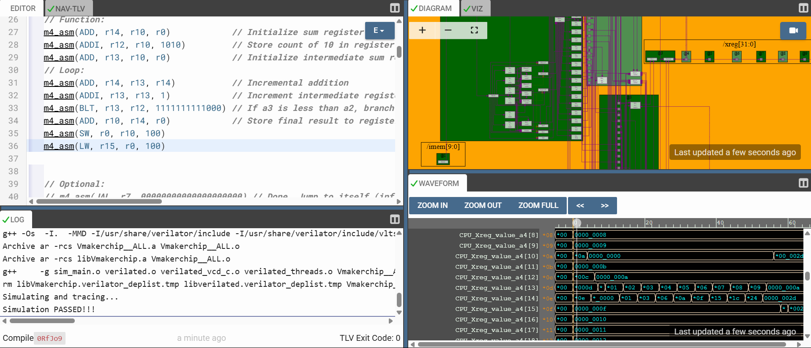

---

## 5. Unconditional Control Flow
The final control flow integration adds instructions that unconditionally mutate the Program Counter during every execution.

* **JAL & JALR (Jump and Link Execution):** Architecting unconditional teleportation. This logic not only forces the Program Counter to a new absolute or relative coordinate, but it strategically leaves a breadcrumb trail. By routing the return address (`PC + 4`) through the datapath and saving it into the Register File, the CPU gains the ability to execute hierarchical software subroutines and successfully return to the main execution loop.
  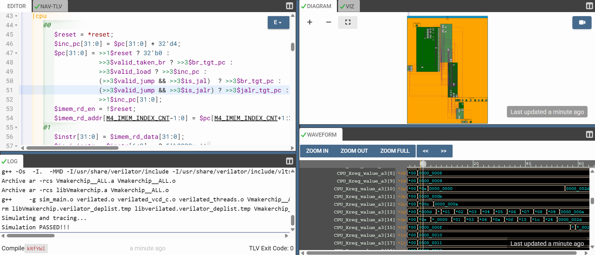

---

> **Architectural Conclusion:** The culmination of Day 5 represents the successful synthesis of a fully functional, 5-stage pipelined RISC-V processor. The custom RTL core natively executes complex, multi-loop assembly programs, demonstrating comprehensive instruction fetching, decode logic, hazard-aware execution, memory interfacing, and precise write-back control.
